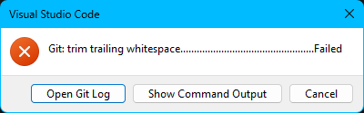
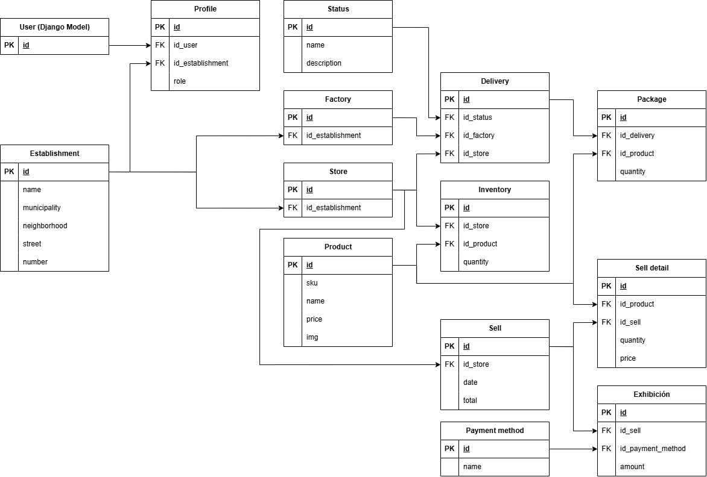

# Manual de desarrollador

Manual de desarrollador que busca introducir y orientar a cualquier persona que participe en el desarrollo, mantenimiento o despliegue de este proyecto.

Este documento está diseñado para que puedas comprender rápidamente la estructura, dependencias y flujos de trabajo principales del sistema, así como las mejores prácticas recomendadas para contribuir de manera efectiva.


## Requerimientos

El proyecto se desarrolló y se prueba con las siguientes versiones:

- __Python 3.12__
- __Poetry__ (para dependencias y entornos virtuales)
- __PostgreSQL__ (modo producción)
- __Redis__ (eventos y notificaciones)

Si vas a ejecutar con Docker, revisa el [manual de operaciones](./runbook.md).

## Estructura del proyecto

El proyecto dispone de la estructura estándar de Django, a continuación se detallan solo las carpetas y archivos relevantes.

- `apps/`: Núcleo lógico del proyecto
  - `_api/`: Mecanismos u utilidades comunes de API REST
  - `_auth/`: Mecanismos de autenticación
  - `_mail/`: Mecanismos de envío de correos
  - `*/`: Otras aplicaciones con lógica de negocio
- `docs/`: Documentación adicional sobre el proyecto
- `project/`: Configuraciones generales del proyecto
  - `config.py`: Configuraciones de variables de entorno
  - `settings.py`: Configuraciones de comportamiento del proyecto

A medida que se manipula el proyecto, es posible que aparezcan archivos como `db.sqlite3` o carpetas de caché.

## Lógica Común

Para evitar redundancia, dentro de `apps/` se usa el prefijo `_` para identificar las aplicaciones que funcionan como utilerías globales. Estas no manejan lógica de negocio ni procesos principales, sino que sirven para centralizar funciones, clases compartidas o decoradores que cualquier otra app pueda necesitar. Al ser herramientas internas, la mayoría no exponen URLs (aunque hay excepciones). A continuación, se repasa brevemente estas apps y su propósito:

### API

Otorga lógica de paneles de administración, propagación de eventos pub/sub, mixins, restricciones de modelos, entre otros.

- __admin.py:__ Proporciona clases heredables que se encargan de la propagación de eventos, eliminaciones físicas y lógicas a partir del panel de administración de Django.
- __gossiper.py:__ Proporciona handlers y tipado de modelos y acciones sobre eventos pub/sub.
- __mixins.py:__ Proporciona mixins a nivel de serializador y viewset para lógica común.
- __models.py:__ Proporciona restricciones y clases heredables que incluyen capacidad de auditoría y eliminación lógica.
- __serializers.py:__ Proporciona utilerías de auditoría a nivel de serializador.
- __views.py:__ Proporciona views o endpoints comunes para APIs REST.

### AUTH

Otorga mecanismos de autenticación y generación de credenciales JWT.

- __backends.py:__ Permite un inicio de sesión flexible mediante un backend de autenticación personalizado.
- __permissions.py:__ Otorga roles de usuario, permisos de operación HTTP y operadores lógicos para definir y combinar permisos atómicos.
- __urls.py:__ Expone los endpoints para los mecanismos de autenticación (login con JWT), consulta de la sesión actual y cierre de sesión.

### MAIL

Otorga handlers y plantillas de correo.

- __templates/:__ Plantillas de correo
- __mails.py:__ Handler para envío de correos especificando plantilla y contexto


## Variables de entorno

Es posible ejecutar el proyecto sin que exista el archivo `.env` o sin configurar las variables del mismo, ya que se establecen valores por defecto. Sin embargo se recomienda configurar los valores necesarios (_en especial en modo producción_) ya que pueden presentarse comportamientos inesperados o inestabilidad en el proyecto.

Consulte la configuración de [variables de entorno](./virtual-env.md) para más información.

## Instalación de dependencias

El proyecto usa [poetry](https://python-poetry.org) como gestor de paquetes, en caso de no contar con el, también es posible instalar las dependencias mediante pip.

A fin de evitar duplicar las dependencias, se omite el archivo requirements.txt. Es necesario que la instalación mediante pip, instale la dependencia de poetry para interpretar correctamente las [dependencias](/pyproject.toml).

> ### Poetry (recomendado)
>
> 1. Instalar dependencias
>     ```sh
>     poetry install
>     ```
>
> 2. Activar el entorno virtual
>     ```sh
>     poetry shell
>     ```

---

> ### Pip con venv
> 1. Crear entorno virtual
>     ```sh
>     python -m venv env
>     ```
> 
> 2. Activar entorno virtual
>     ```sh
>     env\Scripts\activate       # Windows
>     source env/bin/activate    # Linux / macOS
>     ```
> 
> 3. Instalar poetry
>     ```sh
>     pip install poetry
>     ```
> 
> 4. Instalar dependencias
>     ```sh
>     poetry install
>     ```

## Pre-commit

Se utiliza para automatizar la revisión de formato y calidad de código antes de cada commit, asegurando que el historial de Git se mantenga limpio.

### Instalación del pre-commit

Ejecuta el comando de instalación:

```sh
pre-commit install
```

> [!Note]
> Para realizar la instalación es necesario que se hayan [instalado las dependencias](#instalación-de-dependencias).
>
> El comando establece y configura la carpeta `.git/hooks/` la cual no se incluye en el versionamiento, por lo que cada vez que clones el proyecto en una nueva carpeta o máquina, deberás ejecutar ese comando.

A partir de ese momento, cada vez que ejecutes `git commit`, se validarán automáticamente:

- Espacios en blanco innecesarios.
- Finales de archivo correctos.
- Formato y errores de Python mediante __Ruff__.

Si necesitas ejecutarlo manualmente sobre todos los archivos sin hacer un commit:

```sh
pre-commit run --all-files
```

### Configuración de IDE

Es posible que al momento de hacer un commit salga una ventana de error, como la imagen siguiente:



Para evitar que el pre-commit detenga tus commits por errores de formato, se recomienda configurar tu IDE para evitar bloqueos de commit.

Estas configuraciones no buscan reemplazar el uso del pre-commit, únicamente evitan bloqueos frecuentes en el commit.

A continuación se muestra la configuración recomendada para algunos IDEs.

> ### Visual Studio Code
>
> 1. Instala la extension de RUFF (ID: charliermarsh.ruff)
>
> 2. Añade el siguiente fragmento json al archivo `/.vscode/settings.json` o a tus preferencias de usuario
>     ```json
>     {
>       "[python]": {
>         "editor.formatOnSave": true,
>         "editor.defaultFormatter": "charliermarsh.ruff",
>         "editor.codeActionsOnSave": {
>           "source.fixAll.ruff": "always",
>           "source.organizeImports.ruff": "always"
>         }
>       }
>     }
>     ```

En caso de no configurar el IDE y presentar el bloqueo de commit, muchas veces se arregla con agregar los cambios al área de stage y realizar el commit nuevamente para que este termine de procesarse.

## Preparación y ejecución

Con las variables de entorno configuradas y las dependencias instaladas, es posible preparar y ejecutar el proyecto.

1. Ejecutar las migraciones

    ```sh
    python manage.py migrate
    ```

> [!Note]
> En caso de que el proyecto esté configurado en desarrollo `PRODUCTION=False` se crea o actualiza el archivo `db.sqlite3`.
>
> En caso contrario, se aplican las migraciones a la base de datos PostgreSQL configurada en las [variables de entorno](./virtual-env.md).

2. Ejecutar el proyecto
    ```sh
    python manage.py runserver
    ```

## Tests y revisiones

A fin de garantizar la calidad del proyecto y evitar insertar errores sobre la funcionalidad del mismo, se recomienda ejecutar los tests y análisis estáticos.

Ejecuta los tests

```sh
pytest
```

Ejecuta las revisiones de código y formato

```sh
ruff check
```

## Mantenimiento y correcciones

A medida que se desarrolla el proyecto es necesario realizar ciertas operaciones en el mismo para que este pueda adaptarse correctamente a los cambios del proyecto.

### Migraciones y DB

Para generar nuevas migraciones tras cambios en los modelos, crea y aplica las migraciones correspondientes.

```sh
python manage.py makemigrations    # Crea nuevas migraciones
python manage.py migrate           # Aplica las migraciones
```

Como referencia se incluye un diagrama relacional de la base de datos



> [!Note]
> Cada tabla incluye los campos de `created_at`, `updated_at`, `deleted_at` y `version`

### Gestión de la DB

Puede resultar útil manipular la información en la base de datos, para interactuar con ella desde el proyecto es necesario crear un usuario administrador

```sh
python manage.py createsuperuser
```

Seguir las instrucciones para crear el usuario, al finalizar ejecutar el proyecto y visitar la ruta `admin/`.

> [!Note]
> Para crear el usuario administrador, las migraciones deben estar aplicadas.

### Mantenimiento de tests

Los tests definidos no son infalibles. La finalidad de estos es garantizar la calidad del código y evitar romper funcionalidad existente a futuro.

Es posible que los requerimientos cambien, que se extienda o altere una o varias funcionalidades del proyecto, así como la detección de nuevos casos de borde. En cualquiera de esos casos es posible que los tests fallen o que ya no tengan el alcance necesario, de ser así, se deben actualizar los tests afectados.

## Flujo colaborativo

En caso de colaborar en el proyecto, y a fin de permitir un desarrollo consistente y flexible, se recomienda encarecidamente leer y respetar las secciones que se detallan a continuación.

### Ramas

Existen dos ramas principales en el proyecto.

- `main`: Rama destinada a producción, cuenta con revisiones, tests, builds y despliegues automáticos.
- `dev`: Equivalente a __main__, sin integración a entornos productivos. Cuenta únicamente con revisiones y tests automáticos.

Otras ramas que vayan a ser creadas son de formato libre, independientemente de su propósito o longevidad.

### Pull requests

El formato de las pull request es abierto, siempre y cuando sea coherente, concreto y detallado (criterios subjetivos). Hay algunas restricciones que deben seguirse para que estas se terminen integrando al proyecto.

1. Las ramas deben comenzar en `dev` u otras sub-ramas.
2. La pull request debe de pasar todas las revisiones y tests para ser considerada a integración.
3. Si agregas funcionalidad adicional, debes definir los tests correspondientes. Estos deben ser realistas y con una cobertura de los casos de borde como mínimo.
4. En caso de alterar los tests existentes, justificar el motivo en el cuerpo de la pull request.

En caso contrario la pull request puede ser rechazada o detenerse indefinidamente hasta que todos los puntos anteriormente mencionados queden resueltos. También es posible crear PRs de una sub-rama a otra.

En caso de que la pull request sea aceptada, esta debe de ser eliminada del repositorio remoto.

La rama __main__ únicamente recibe pull request de la rama __dev__.

### Workflows

Se disponen de varios workflows de GitHub Actions configurados, muchos de ellos destinados al CI y CD del proyecto, a continuación se detallan los workflows configurados y sus desencadenantes.

| Flujo | Descripción | Trigger |
| - | - | - |
| quality.yml | Ejecuta tests y revisiones de código | PRs a __main__ o __dev__ / Manual |
