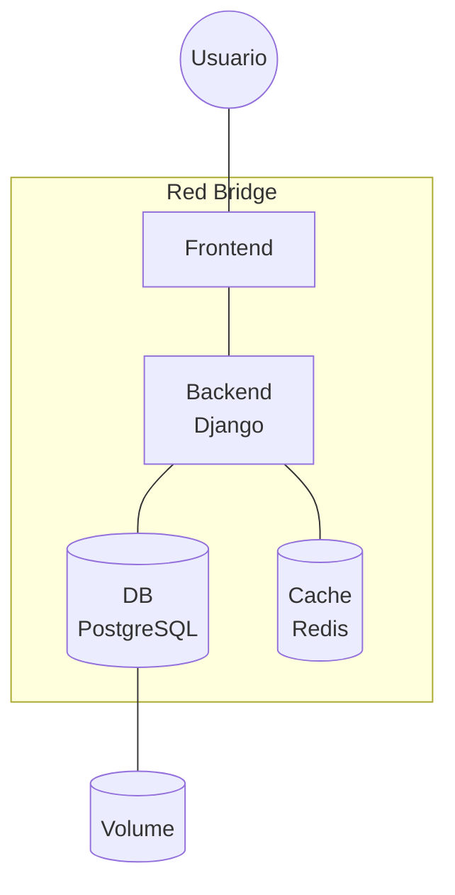

# Manual de operaciones

Manual de operaciones que tiene como propósito guiar la ejecución, verificación y operación del proyecto. Incluye un ejemplo con Docker Compose para validar el stack en un entorno controlado.

## Arquitectura

La arquitectura base incluye un cliente (frontend) que consume la API por HTTP. La API depende de PostgreSQL y Redis. El archivo `docker-compose.yml` es un ejemplo de despliegue para ejecutar estos servicios en contenedores.

Diagrama lógico (alto nivel):



## Requerimientos

Es necesario disponer de [docker](https://www.docker.com) instalado en el equipo anfitrión, adicionalmente se recomienda tener descargadas las siguientes imágenes:

- Python __3.12-slim__
- PostgreSQL __18-alpine__
- Redis __7-alpine__

> [!Warning]
> Al momento de desplegar el proyecto, es indispensable que las variables de entorno estén configuradas en su totalidad. Consulte las [variables de entorno](./virtual-env.md) para más información.

## Ejemplo con Docker Compose

Se incluye un [docker compose pre-configurado](/docker-compose.yml) como ejemplo de despliegue para validar el stack en un entorno controlado.

Ejecutar el ejemplo
```sh
docker compose up -d
```

Esto levantará los contenedores del ejemplo con la siguiente distribución de puertos:

- `cookiexpend-api` (Proyecto) -> 8000
- `cookiexpend-db` (PostgreSQL) -> 5432
- `cookiexpend-redis` (Redis) -> 6379

> [!Warning]
> En el ejemplo se exponen los contenedores de __Postgres__ y __Redis__, pero se aconseja que estos no queden expuestos en un despliegue real

El ejemplo también crea una red llamada `cookiexpend-network` para comunicar todos los contenedores y un volumen para la base de datos, permitiendo la persistencia de los mismos.

## Ejemplo con Docker Build/Run

Este ejemplo ejecuta solo el contenedor de la API. Asegúrate de tener PostgreSQL y Redis disponibles y configurados en las variables de entorno.

Construir la imagen

```sh
docker build -t cookiexpend-api .
```

Ejecutar el contenedor

> ### Linux / macOS
> ```sh
> docker run -d --name app \
>   -e 'PRODUCTION=True' \
>   -e 'DJANGO_SECRET_KEY=your_secret_here' \
>   ... \
>   -p 8000:8000 \
>   --network my_network \
>   cookiexpend-api
> ```

---

> ### Windows
> ```sh
> docker run -d --name app `
>   -e 'PRODUCTION=True' `
>   -e 'DJANGO_SECRET_KEY=your_secret_here' `
>   ... `
>   -p 8000:8000 `
>   --network my_network `
>   cookiexpend-api
> ```

> [!Note]
> Consulta la configuración de [variables de entorno](./virtual-env.md) para definir los valores correctos.

## Health check

Una vez el contenedor se encuentre levantado y en ejecución, para comprobar que este esté disponible, debe de consultarse el endpoint `api/health/` para verificar que el proyecto este disponible y se haya conectado a la base de datos. Por otro lado también debe de verificarse la disponibilidad de eventos con el endpoint `api/events/`:

```sh
curl <domain>/api/health/
# la respuesta debe ser -> {"healthy":true}

curl <domain>/api/events/
# la respuesta debe contener -> {"status": "connected"}
```

> [!Note]
> Reemplaza `<domain>` con el dominio que se este usando como: `http://localhost:8000`, `https://site.example.com` o similar.
